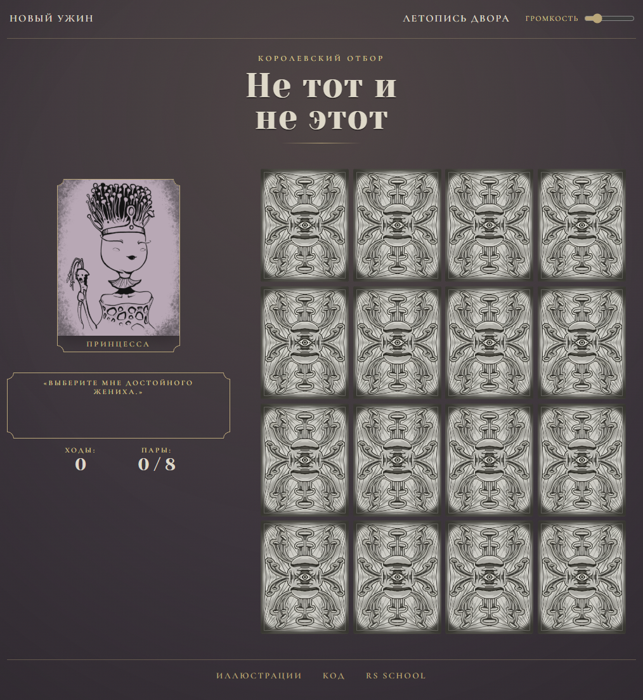

# Memory Game: Не тот и не этот

Мемори-игра в жанре овощного тёмного фэнтези. Восемь принцев-овощей добиваются руки принцессы. Каждую найденную пару она отвергает и съедает, а последний оставшийся становится её избранником.

**[Играть →](https://yaroslavagd.github.io/memory-game/)**


## Как играть

Откройте две карточки и найдите пару. Любая попытка считается ходом, даже неудачная. Чем меньше ходов, тем выше результат в "Летописи двора" (топ-10 хранится в браузере).

## Особенности

- Чистый JS (ES-модули), без библиотек и сборщиков
- Архитектура в духе мини-Redux: `store`, чистый `reducer`, эффекты (звуки, таймер, победа)
- У каждого съеденного принца есть своя история и свой вердикт.
- Звуки, ползунок громкости и сохранение выбранной громкости.


## Структура проекта

```
app/
  core/       игровая логика: константы, reducer, селекторы, колода
  store/      хранилище состояния
  services/   localStorage: таблица лидеров, громкость
  effects/    реакции на изменения состояния: звуки, таймер, победа
  ui/         компоненты интерфейса
  utils/      вспомогательные функции
styles/       стили
assets/       изображения и звуки
```

## Локальный запуск

ES-модули не работают через `file://`, нужен локальный сервер:

```bash
git clone https://github.com/YaroslavaGD/memory-game.git
cd memory-game
git checkout memory-game
npx serve
```

Откройте адрес, который покажет команда (обычно `http://localhost:3000`). Альтернатива: расширение Live Server в VS Code, команда «Open with Live Server» на `index.html`.

## Авторство и права

- Иллюстрации: Aleksandr Stejnbreher. Все права принадлежат автору, использование отдельно от проекта без его согласия запрещено.
- Звуки: см. [assets/LICENSE.md](assets/LICENSE.md)
- Шрифты: Yeseva One, Cormorant Garamond (SIL OFL)
- Код: Yaroslava Hryzadubova, 2026, MIT, см. [LICENSE](LICENSE.md)